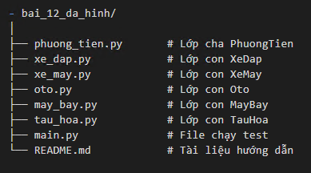
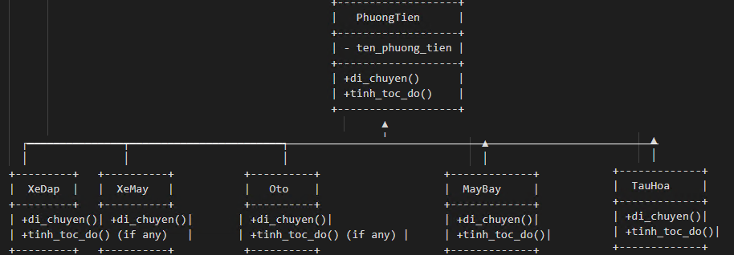

# Bài 12 – Tính Đa Hình trong Python OOP
**Mục tiêu**
Bài này minh họa tính đa hình (Polymorphism) thông qua mô hình quản lý phương tiện giao thông. Các phương tiện sẽ di chuyển khác nhau và có tốc độ khác nhau dù cùng sử dụng tên phương thức.

- Mô hình lớp
Chúng ta có lớp cha PhuongTien, các lớp con như:
- - XeDap
- - XeMay
- - Oto
- - TauHoa
- - MayBay

Tất cả đều kế thừa phương thức `tinh_toc_do()` từ PhuongTien, nhưng có thể ghi đè (override) phương thức `di_chuyen()` theo hành vi riêng

- bai_12_da_hinh/

- Ý nghĩa đa hình
Cùng là phương thức di_chuyen() nhưng mỗi phương tiện có hành vi khác nhau.

Phương thức tinh_toc_do() kế thừa từ lớp cha, *nhưng có thể được ghi đè* với hệ số hiệu chỉnh tốc độ trong các lớp con (ví dụ lớp máy bay, tàu hỏa).

* UML Diagram
         
-  Kiến thức áp dụng
`Tính đa hình`: cùng một phương thức nhưng có thể hành xử khác nhau.
`Override phương thức`: viết lại hành vi trong lớp con.
`Sử dụng kế thừa`: tận dụng phương thức chung ở lớp cha.
