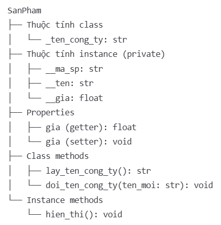
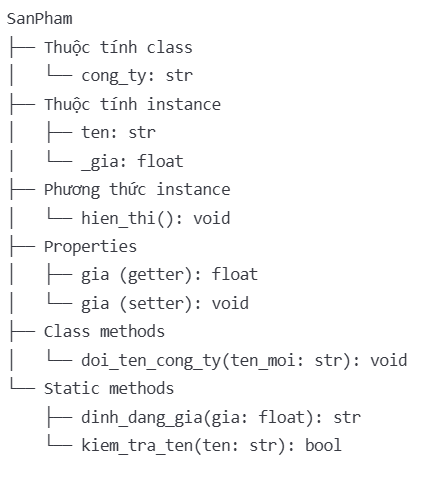

##

## bai_13_03_classmethod_setter_tt
**`Quản lý Sản phẩm`**
Một module Python đơn giản để quản lý thông tin sản phẩm trong cửa hàng, minh họa việc sử dụng Python decorators (@classmethod, @property) và các khái niệm về encapsulation.
`@classmethod`: Dùng để đổi thông tin chung toàn class (_ten_cong_ty)
`@property và @setter`: Dùng để cập nhật thông tin riêng từng object (gia)

**Tính năng**
- Quản lý thông tin sản phẩm với mã, tên và giá
- Bảo vệ dữ liệu thông qua các thuộc tính private (__ma_sp, __ten, __gia)
- Kiểm tra tính hợp lệ của dữ liệu (đảm bảo giá không âm)
- Quản lý thông tin chung cho tất cả sản phẩm (tên cửa hàng)
- Định dạng hiển thị thông tin sản phẩm theo tiền tệ Việt Nam (VND)
**Cấu trúc:**

## bai_13_04_classmethod_staticmethod

**`Quản lý Sản phẩm`**
Đây là một module Python đơn giản để quản lý thông tin sản phẩm, thể hiện việc sử dụng các decorators trong Python như:
`@classmethod`: Dùng để thay đổi thông tin chung cho tất cả các instance của class (như tên công ty)
`@staticmethod`: Tạo các hàm tiện ích độc lập, không phụ thuộc vào instance hay class (như định dạng giá)
`@property và @setter`: Kiểm soát việc truy cập và thay đổi thuộc tính (đảm bảo giá sản phẩm luôn hợp lệ)
**Tính năng**
- Quản lý thông tin sản phẩm: Lưu trữ tên và giá của sản phẩm
- Kiểm tra dữ liệu: Đảm bảo giá sản phẩm không âm và tên sản phẩm hợp lệ
- Thay đổi thông tin chung: Cập nhật thông tin công ty cho tất cả sản phẩm
- Định dạng dữ liệu: Hỗ trợ định dạng giá theo tiền Việt Nam (VND)

**Cấu trúc:**
